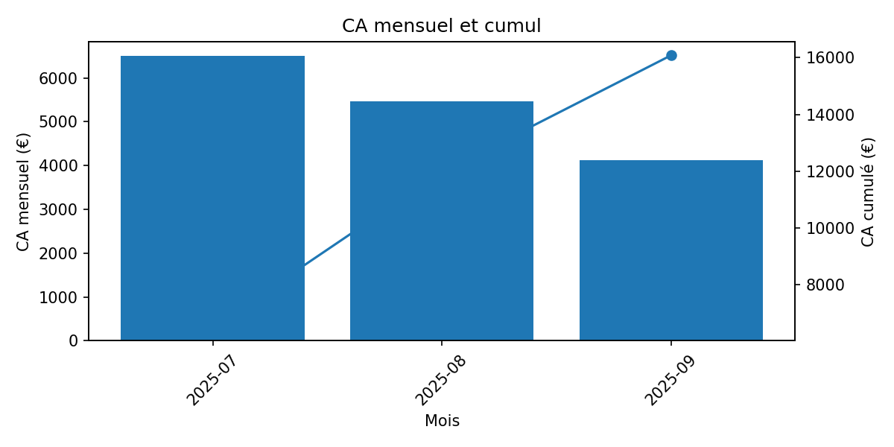
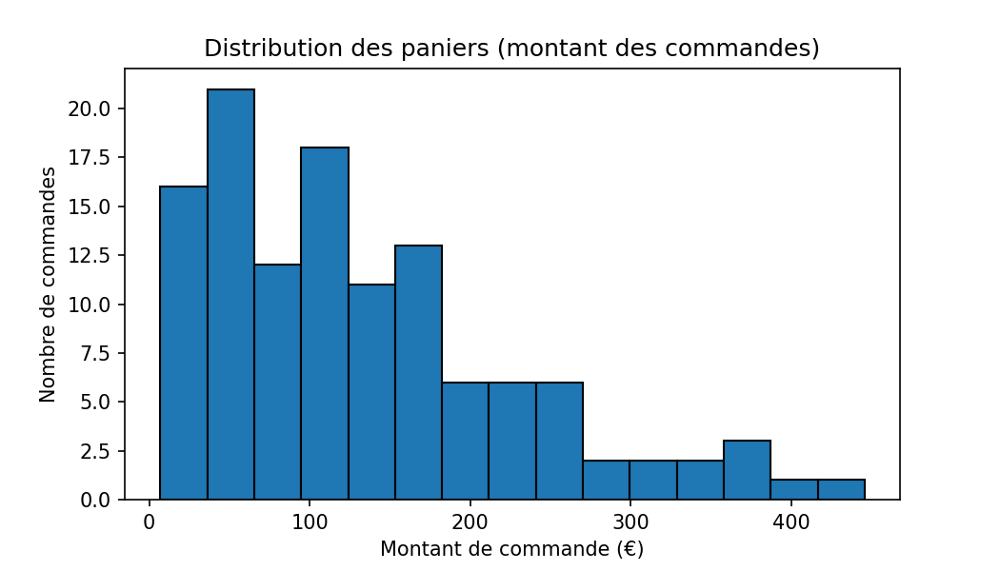
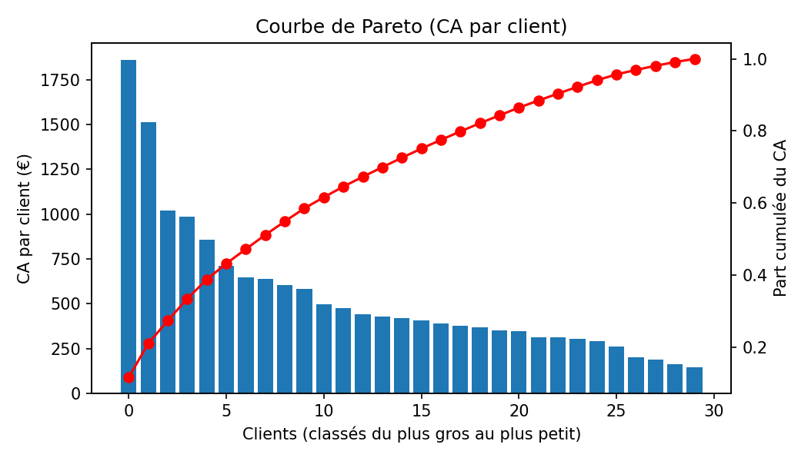
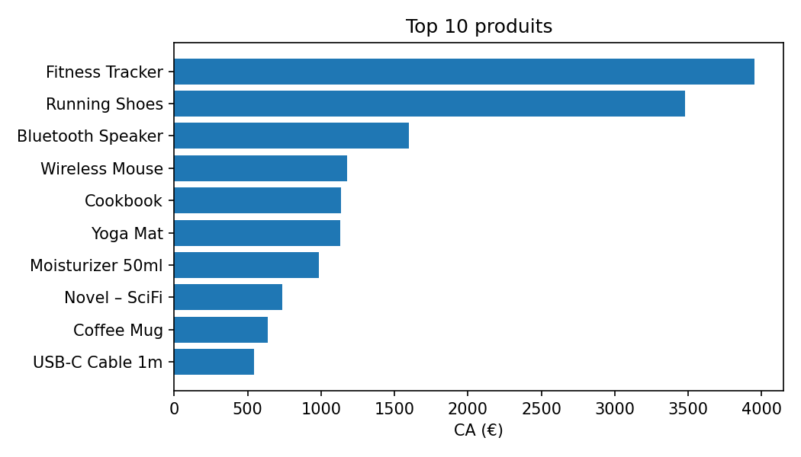
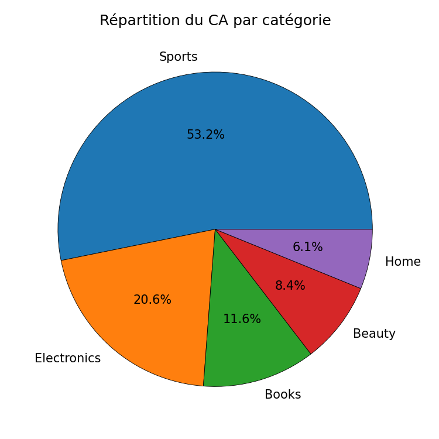

# 🛒 E-commerce Analytics Dashboard

Ce projet présente une **analyse complète des ventes d’un site e-commerce fictif**, construite à partir d’une base de données générée en Python et analysée sous Jupyter Notebook.

---

## 🎯 Objectifs
- Explorer la structure d’un jeu de données e-commerce (clients, produits, commandes).
- Réaliser des analyses business clés :  
  - CA total, panier moyen, taux de réachat  
  - Évolution du CA mensuel  
  - Analyse Pareto (top clients)  
  - Top produits & catégories
- Visualiser les résultats à l’aide de `matplotlib` et `pandas`.

---

## 🧮 Données utilisées
Les données ont été **générées artificiellement sous Python** afin de simuler une activité e-commerce réaliste (commandes, clients, produits).  
Ce jeu de données volontairement léger permet de se concentrer sur la logique d’analyse et la structure de la base.  
➡️ La même méthodologie pourrait être appliquée à une base **plus massive ou réelle**, sans modification majeure du pipeline d’analyse.

---

## 🧩 Stack technique
- **Langage :** Python 3  
- **Librairies :** pandas, matplotlib, sqlite3  
- **Base de données :** SQLite (`data/ecommerce.db`)  
- **Notebook :** `day4_analysis.ipynb`

---

## 📊 Analyses principales

| Thème | Exemple de visualisation |
|-------|---------------------------|
| CA mensuel & cumul |  |
| Distribution des paniers |  |
| Pareto clients |  |
| Top produits |  |
| Répartition du CA par catégorie |  |

---

## 🔍 Insights business

- Le **CA total** atteint environ **15 000 €** sur 3 mois, avec un **panier moyen** d’environ **130 €**.  
- La majorité des commandes se situent entre **50 et 150 €**, quelques gros paniers tirant la moyenne vers le haut.  
- Environ **30 % des clients génèrent 80 % du chiffre d’affaires** → enjeu de fidélisation des “clients VIP”.  
- Les **catégories Sport et Électronique** concentrent la majeure partie du revenu, portées par des produits comme les *Running Shoes* et le *Fitness Tracker*.  
- Une **baisse du CA en septembre** suggère un possible effet de **saisonnalité** ou de **baisse de réachat** à surveiller.

---

## 🚀 Auteur
👤 **Kévin Lemoine**  
Data Analyst – Projet personnel de portfolio  
📧 contact : kevin.lemoine.data
🔗 [LinkedIn](https://www.linkedin.com/in/kevin-lemoine-2313701b8/) | [GitHub](https://github.com/kevinlemoinedata)
